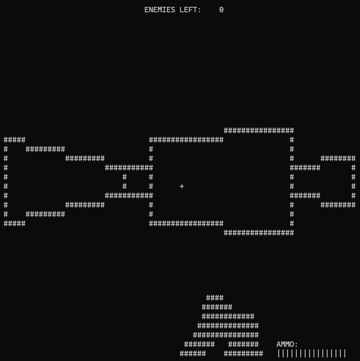

# Doom-like terminal renderer

# About the Program
This project is an immitation of the original DOOM (1993) based on rasterization in the terminal. It is a 3d renderer built from scratch in C++ to run in the windows command line without using OpenGL or DirectX. The render pipeline is based on projection and camera transforms of points, BSP tree plane sorting, near-plane clipping  , and screen-space line drawing and polygon filling.

## How to Build/Run
1. Build (windows)
`g++ doom.cpp -o doom`
2. Run
`./doom.exe`

## Controls
wasd - movement
left/right arrow keys - pan camera left/right
spacebar - shoot

## Gameplay
The game objective was made secondarily to the render pipeline, and is therefore very simple. Use the gun to shoot all the circular stationary targets placed throughout the level until the counter at the top of the screen displays that none are left.
