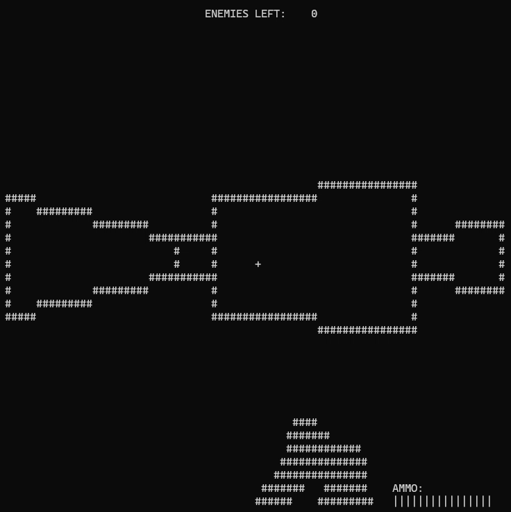

# Terminal DOOM
First-person 3D game that runs in the terminal on Windows, built from scratch in C++ with no graphics API (no OpenGL, DirectX, or third-party rendering library). Inspired by the original *DOOM* (1993), based on a 3D polygon pipeline instead of DOOM's original raycasting approach.
<br></br>




## Overview
The level is represented as a set of vertical quadrilateral planes and sprite positions in 3D space. Each frame is constructed using the camera's rigid pose to transform wall quads into camera space, clip them against the near plane, project them to screen space, and redraw the edges and interior, whereafter they are rasterized into a grid of ASCII characters and printed to the console. This is enabled by sorting the quads into a Binary Space Partitioning (BSP) tree at startup, which the renderer traverses every frame in a back-to-front painter's algorithm to determine a camera-relative draw order for the quads that the sprites are also interleaved into. 

## Features
- Full 3D environment rendering built on polygon transformation pipeline instead of raycasting, implemented with hand-written tensor operations, avoiding external graphics or math libraries
- Static BSP tree constructed at startup from level geometry is used each frame to create efficient painter's algorithm back-to-front surface ordering
- Near-plane clipping (Sutherland–Hodgman) to prevent geometry behind the camera from being rasterized
- Segment-based collision detection against a set of collision polygons, independent of the rendered wall mesh
- Basic gameplay implemented for demonstration with gun mechanics and distance-scaled enemy sprites sorted into painter's algorithm

## Execution Flow
1. Define wall surfaces and collision polygon floor layout. Construct the BSP tree.
    - BSP tree construction algorithm:
        1. Starting from the list of all the polygons: Choose a polygon P and make a node N representing the plane that contains it.
        2. For each other polygon p in the list, classify it as in front of or behind N's plane based on the sign of its centroid relative to that plane, and place it into the corresponding list.
        3. Recurse on the lists of polygons in front of or behind P to define the left and right children
2. Gameplay/Render Loop: 
    1. Poll keyboard input and resolve movement, camera turn, shooting, and reload requests
        - Movement requests are first checked against the collision polygon set: walk along the edges of every polygon and only approve the new position if it remains outside the collision range of every edge
        - Hit detection on shooting is accomplished with a simple trick: each enemy sprite is drawn using a unique set of characters, so a hit is recorded if the top pixel rendered at the center of the screen is an enemy ASCII character, and the target destroyed is the enemy coded to that character
    2. Traverse the BSP tree to obtain a back-to-front ordering (painter's algorithm) relative to the camera's position, also classifying sprites against each node to interleave them into the same order. 
        - Draw functions for polygons:
            1. Convert points from world to camera space
            2. Clip against near plane (sutherland-hodgman)
            3. Apply perspective projection matrix, projecting points onto 2D plane
            3. Draw each edge of polygon (bresenham's line)
            4. Fill interior of polygon (scanline fill)
            5. Write to the canvas
        - Draw functions for sprites:
            1. Convert anchor point from world to camera space
            2. Scale the sprite according to distance
            3. Write to canvas
    3. Transcribe the canvas to a string, overlay UI elements (ammo, gun viewmodel, enemy counter), and print it in place to console
    4. Sleep for the remainder of the frame budget to hold to the target frame rate

## Building and Running
Requires a Windows environment and a C++ compiler with access to `windows.h`

```powershell
# Build
g++ doom.cpp -o doom
 
# Run
./doom.exe
```

## Gameplay
The game objective was made secondarily to the render pipeline, and is therefore very simple. Use the gun to shoot all the circular stationary targets placed throughout the level until the counter at the top of the screen displays that none are left.


### Controls
| Input | Action |
|---|---|
| `W` / `A` / `S` / `D` | Move forward / left / back / right, relative to current facing |
| Left / Right arrow keys | Turn camera left / right |
| Spacebar | Fire gun |
| `R` | Reload gun manually |


## Configuration
 
Constants defined near the top of `doom.cpp`:
 
| Constant | Description |
|---|---|
| `IMAGE_WIDTH` / `IMAGE_HEIGHT` | Resolution of the rendered frame |
| `FRAMERATE` | Target simulation/render rate in Hz |
| `AMMO_MAX` | Shots before a reload is required |
| `RELOAD_DUR` | Reload duration in frames |
| `MOVE_SPEED` | Distance moved per frame while a movement key is held |
| `COLLISION_DISTANCE` | Minimum allowed distance from the camera to any collision polygon edge |
| `FOCAL_LENGTH` | Focal length used in the perspective projection matrix |
| `NEAR_PLANE` | Near-plane distance used for polygon clipping |
| `SPRITE_SCALE` | Base scale multiplier applied to enemy sprites before distance scaling |
